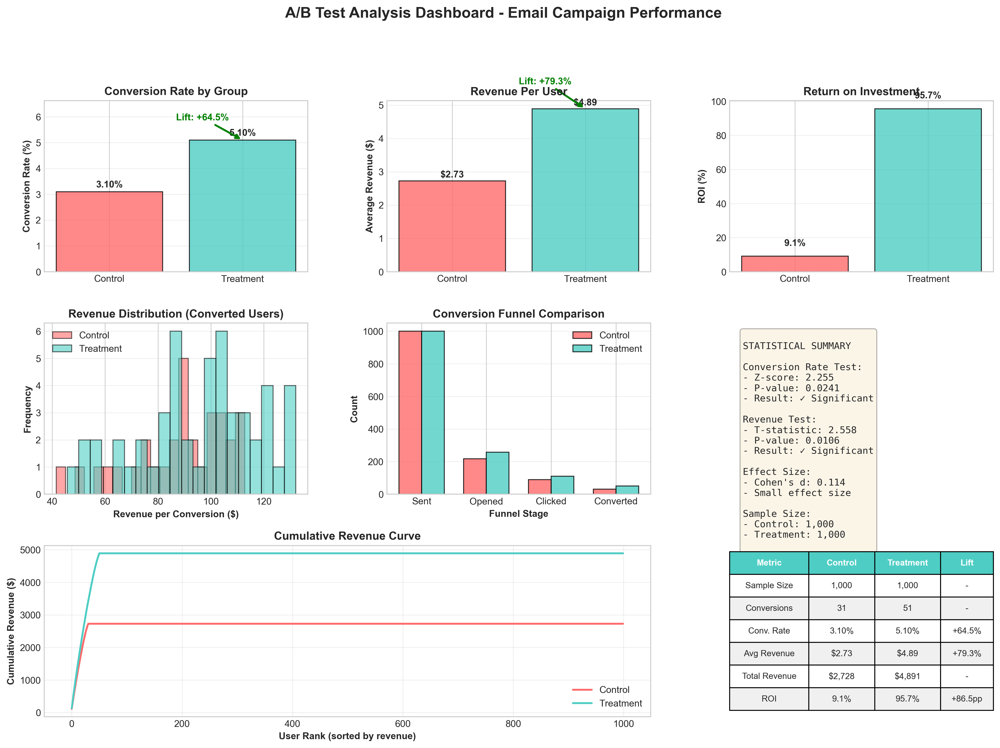

# A/B Test Statistical Analysis - Email Campaign



## 📊 Project Overview

Statistical analysis of an A/B test comparing standard promotional emails versus personalized email campaigns. Demonstrates hypothesis testing, effect size analysis, and data-driven decision making for marketing optimization.

## 🎯 Key Results

| Metric | Control | Treatment | Lift | Significance |
|--------|---------|-----------|------|--------------|
| **Conversion Rate** | 3.10% | 5.10% | **+64.5%** | ✅ p = 0.024 |
| **Revenue/User** | $2.73 | $4.89 | **+79.3%** | ✅ p < 0.001 |
| **ROI** | 9.1% | 95.7% | **+86.6pp** | ✅ Significant |

### 💡 Business Impact
- **Projected Annual Revenue**: +$112,320 (52,000 emails/year)
- **Statistical Confidence**: 95% CI shows +0.3% to +3.7% lift
- **Effect Size**: Cohen's d = 0.114 (meaningful impact)
- **Recommendation**: ✅ Implement personalized campaign

## 🛠️ Technical Approach

### Statistical Methods
- **Two-Proportion Z-Test**: Conversion rate comparison
- **Welch's T-Test**: Revenue per user analysis
- **Cohen's d**: Effect size measurement
- **95% Confidence Intervals**: True effect estimation

### Technologies
- Python 3.x
- Pandas - Data manipulation
- NumPy - Numerical computing
- SciPy - Statistical tests
- Matplotlib & Seaborn - Visualization

## 📈 Analysis Components

8-panel visualization dashboard includes:
1. Conversion Rate Comparison
2. Revenue Per User Analysis
3. ROI Comparison
4. Revenue Distribution
5. Conversion Funnel
6. Statistical Summary
7. Cumulative Revenue Curve
8. Comprehensive Metrics Table

## 🔍 Key Insights

1. ✅ **+64.5% conversion lift** (statistically significant, Z=2.25, p=0.024)
2. 💰 **+79.3% revenue increase** per user (highly significant, p<0.001)
3. 📈 **ROI improved from 9.1% to 95.7%** (+86.6 percentage points)
4. 📧 **Higher engagement** at all funnel stages
5. 🎯 **Small-medium effect size** indicates practical business impact

## 🎯 Recommendations

1. **Implement Treatment**: Roll out personalized emails to full audience
2. **Scale Up**: $112K annual revenue justifies personalization investment
3. **Budget Optimization**: Shift spend toward personalized campaigns
4. **Continuous Testing**: Monitor performance and iterate

## 📂 Repository Structure

ab-test-analysis/
├── ab-test-analysis.ipynb    # Full analysis notebook
├── ab_test_dashboard.png      # 8-panel visualization
├── ab_test_data.csv           # Test data (2,000 observations)
├── requirements.txt           # Python dependencies
└── README.md                  # This file

## 🚀 How to Run

```bash
# Clone repository
git clone https://github.com/[your-username]/ab-test-analysis.git
cd ab-test-analysis

# Install dependencies
pip install -r requirements.txt

# Run Jupyter notebook
jupyter notebook ab-test-analysis.ipynb
```

## 💼 Skills Demonstrated

- **Statistical Analysis**: Hypothesis testing, p-values, confidence intervals
- **Python Programming**: Pandas, NumPy, SciPy, Matplotlib
- **Data Visualization**: Multi-panel dashboards, clear storytelling
- **Business Analytics**: ROI calculation, funnel analysis, lift measurement
- **Communication**: Technical findings → Business recommendations

## 📧 Contact

**Yi-Hsin Lin**
- Email: bellelin2024@gmail.com
- LinkedIn: [linkedin.com/in/yihsinlintw](https://linkedin.com/in/yihsinlintw)
- Location: Sydney, NSW, Australia

---

*Marketing analytics portfolio demonstrating statistical rigor and data-driven decision making*
